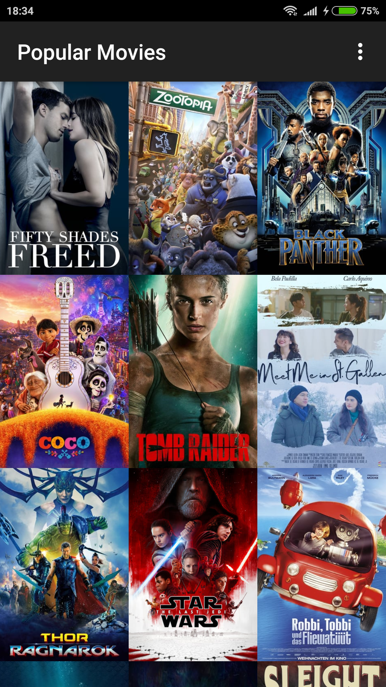
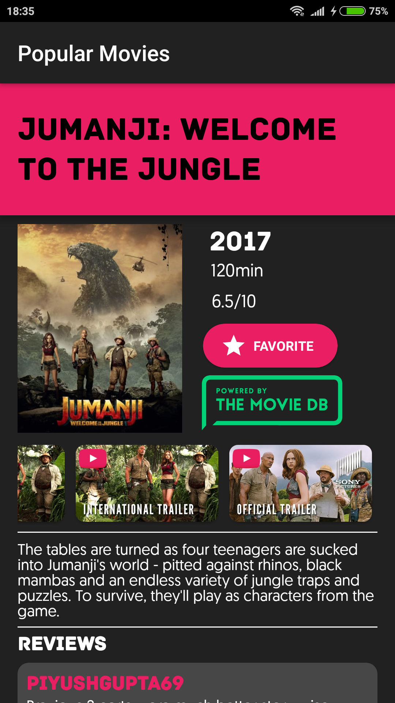
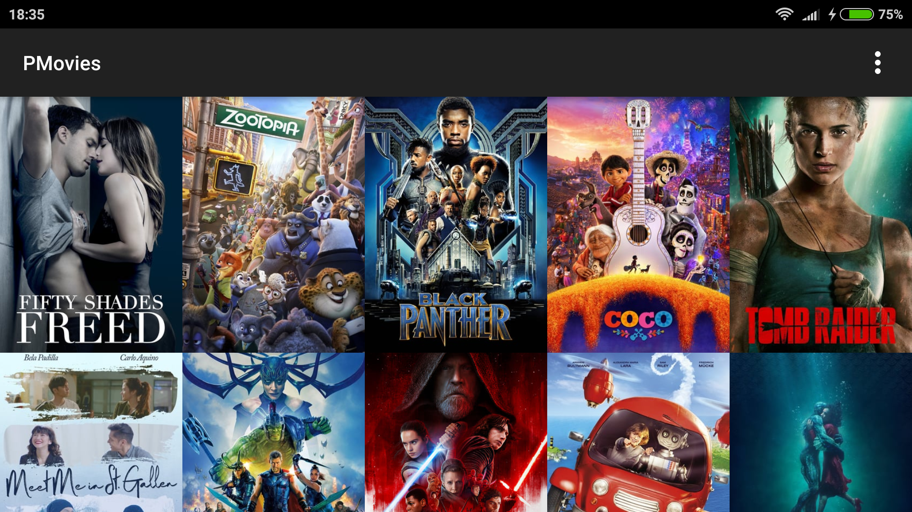
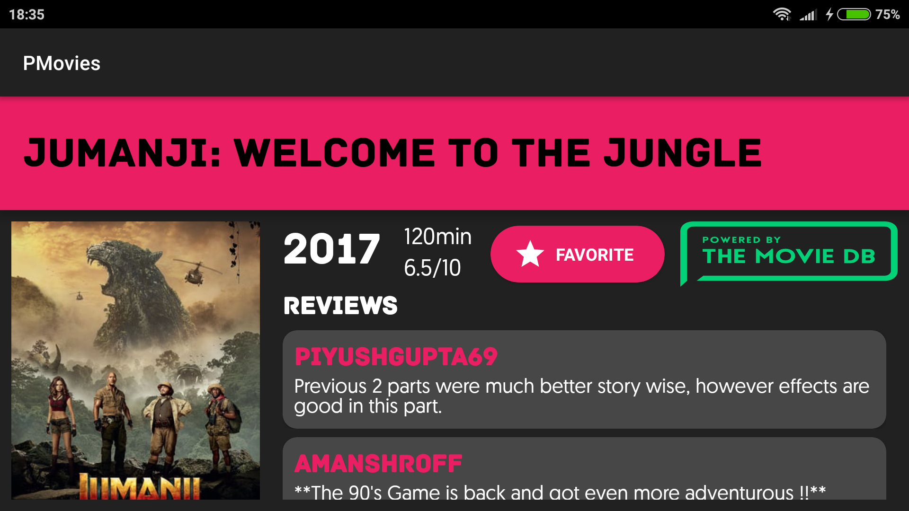

# Popular Movies Project
Productionize an app as part of the Advanced Android Developer Nanodegree.
The app will present the user with a grid arrangement of movie posters upon launch.

## What I Learned
- Use Retrofit HTTP client in background threads.
- Use Picasso Library for image loading.
- User favorite data stored in native SQLite database and are exposed via a ContentProvider.
- Connect to API and retrieve JSON data.

## App Description
- Allow your user to change sort order via a setting(Popular / Highest Rated/ Favorites)
- Allow the user to tap on a movie poster and transition to a details screen with additional information such as:
	- Original title
	- Movie poster image thumbnail
	- A plot synopsis
	- User rating
	- Release date
	- Read reviews
	- Play Trailer
- Allow the user to rotate the phone and adjust the layouts
- Saves User Favorites on the phone DB
- Including a Content Provider
- Support both portrait and landscape

-----------------------
 

